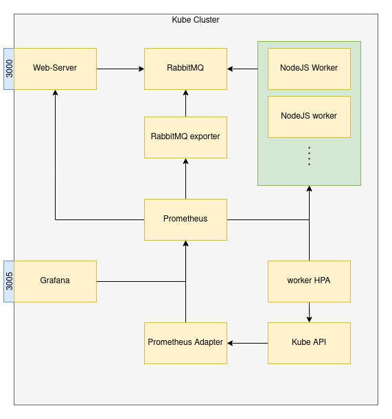

# Kubernetes Autoscaling Example
In this project, I try to implement Horizontal Pod Autoscaler[HPA](https://kubernetes.io/docs/tasks/run-application/horizontal-pod-autoscale/) provided by [Kubernetes](https://kubernetes.io/). The Horizontal Pod Autoscaler automatically scales the number of [Pods](https://kubernetes.io/docs/concepts/workloads/pods/) in a [replication controller](https://kubernetes.io/docs/concepts/workloads/controllers/replicationcontroller/), [deployment](https://kubernetes.io/docs/concepts/workloads/controllers/deployment/), [replica set](https://kubernetes.io/docs/concepts/workloads/controllers/replicaset/) or [stateful set](https://kubernetes.io/docs/concepts/workloads/controllers/statefulset/) based on observed CPU utilization (or, with **custom metrics** support, on some other application-provided metrics).

We start by creating a [golang](https://golang.org/) web-server that publishes messages to a [rabbitmq queue](https://www.rabbitmq.com/). These messages are then consumed by a [NodeJS](https://nodejs.org/en/) worker. The worker takes 5s to consume 1 message, representing artificial time to process a request. We then try to scale the worker pods on the basis of the rabbitmq queue length. We'll discuss the entire infra in the upcoming section and role of each part in detail. 

# Demo
<div align="center">

</div>

# Architecture
<div align="center">
    
</div>
<br>

## Web-server
A simple golan server with two routes, one for pushing messages to rabbitmq queue and one for exposing metrics. We are collecting 2 metrics, `http_request_total` and `request_status` to monitor number of request on and status returned by each route respectively. 

### Routes
```
GET /generate    # push message to queue
GET /metrics     # expose metrics for Prometheus server

```

## RabbitMQ
Rabbit MQ is a simple open-source message-broker that can be deployed with ease. The broker has wide support of client libraries across different programming languages. Rabbitmq is widely used in industry and has proven it's mettle. We use Advance Message Queuing Protocol([AMQP](https://www.amqp.org)) as our messaging protocol for both web-server and worker.

## NodeJS Worker
A simple nodejs application that connects to rabbitmq queue anc consumes messages. In order to generate a real life scenario, we take one message at a time and add a delay of 5 sec, representing the time needed to process a message. This way we'll be able to generate fake traffic when we try to run our architecture.

## Prometheus-stack
As discussed above, our goal is to auto-scale by looking at the queue length anf to achieve this we need to add monitoring service to our Cluster. Prometheus is one of the best options available for monitoring tasks. To make things easy and save ourselves from writing manifest files, we'll use helm charts for deployment. We use a [kube-prometheus-stack](https://github.com/prometheus-community/helm-charts/tree/main/charts/kube-prometheus-stack) chart by [prometheus-community](https://github.com/prometheus-community). The chart comes with Prometheus, [Grafana](https://grafana.com/), [Prometheus operator](https://github.com/prometheus-operator/prometheus-operator) and lot of default configurations for these services. Lets look at the role of each component.

* __Prometheus__: a open-sourced CNCF graduate responsible for all our monitoring and alerting needs across the cluster. I was originally built by [SoundCloud](https://soundcloud.com/) and then handed over to CNCF for maintenance and further development.

* __Grafana__: a open source observability platform using generate beautifully dashboard. We use Grafana to consume Prometheus metrics in a human readable fashion. 

* __Prometheus Operator__: The Prometheus Operator provides Kubernetes native deployment and management of Prometheus and related monitoring components. The purpose of this project is to simplify and automate the configuration of a Prometheus based monitoring stack for Kubernetes cluster.

## RabbitMQ exporter
Most of the service does not support Prometheus metrics out of box and need a middleware to do so. This is where [Exporters](https://prometheus.io/docs/instrumenting/exporters/) come in picture. In our case, rabbitmq's management service collects metrics but they are not compliant for Prometheus. There are community is actively adding exports and thus it likely that you'll find one for your service. You can check for different available exporter [here](https://prometheus.io/docs/instrumenting/exporters/). We use [prometheus-rabbitmq-exporter](https://github.com/helm/charts/tree/master/stable/prometheus-rabbitmq-exporter) helm chart to make deployment process easy. Now Prometheus server can pull metrics from this exporter.

## Prometheus Adapter
Kubernetes only monitors recourses like compute and memory metrics for pods. While defining our HPA manifest we need to mention the type of metric to look for. There are three types of metrics available
* Resource: default monitoring by Kubernetes 
* Custom: metrics that are not recorded by k8s but is related to it's Objects
* External: metrics that are not related to k8s Objects.

We use External type as Queue length is not monitored by Kubernetes and is not related to Kubernetes Objects. Since all objects talk to API-server, adapter exposes these metrics to API server.

# How to run 

In this example, we are using [minikube](https://minikube.sigs.k8s.io/docs/start/) as our local cluster setup. We start by deploying our Kube-prometheus-stack first. We'll use the default config values for this setup.
<details>
<summary>
Building docker images
</summary>

>You can use docker-compose command to build the web-server and Worker node images as they'll be used in cluster. To build images simply run `docker-compose build`

</details>
<br>

```bash
$ helm install prometheus prometheus-community/kube-prometheus-stack
```

Next deploy our RabbitMQ server, Web-Server and NodeJs worker using manifest files.
```bash
$ kubectl apply -f rabbitmq/deploy.yml
$ kubectl apply -f web-server/deploy.yml
$ kubectl apply -f worker/deploy.yml
```

Once our application is up, we proceed with rabbitmq exporter and prometheus adapter.
```bash
$ helm install rabbitmq-exporter prometheus-community/prometheus-rabbitmq-exporter -f rabbitmq/values.yml
```
```bash
$ helm install prometheus-adapter prometheus-community/prometheus-adapter -f prometheus/adapter-values.yml
```

So your now our prometheus adapter is up lets see if our metrics is exposed.
```bash
$ kubectl get --raw "/apis/external.metrics.k8s.io/v1beta1/" | jq

{
  "kind": "APIResourceList",
  "apiVersion": "v1",
  "groupVersion": "external.metrics.k8s.io/v1beta1",
  "resources": [
    {
      "name": "rabbitmq_queue_length",
      "singularName": "",
      "namespaced": true,
      "kind": "ExternalMetricValueList",
      "verbs": [
        "get"
      ]
    }
  ]
}

```
As seen above, the metric is available and is ready for API server to consume. Now the final setup is to create our HPA. We create a HPA for our worker using manifest file that is available under `worker/hpa.yml`
```bash
$ kubectl apply -f worker/hpa.yml
horizontalpodautoscaler.autoscaling/worker-scaler created

$ kubectl get hpa
NAME            REFERENCE           TARGETS   MINPODS   MAXPODS   REPLICAS   AGE
worker-scaler   Deployment/worker   0/20      1         10        1          22s

```

So are HPA is created and is ready to scale our worker deployment. You can see that the current Replica count is 1 since the metric value is under target. Now you can expose your web-server service using `kubectl port-forward` command and hit `/generate` route from browser multiple time in order to generate some traffic. You'll see the metric value rise and Replica count increase.

# My learnings
Initially I considered it to be a easy and started very casually, but soon I realised different accepts of the problem. I didn't know that I'll have to use Prometheus as a metric server cause rabbitmq's management image exposed the need metrics on `/api/metrics` route. So I was in impression that I'll just need to pass pass this url to HPA and use the metric to scale. I was wrong( or didn't get a way to achieve this), thats not how Kubernetes work. I got to know about why we need to use Prometheus to use metrics, then I learnt about exporters and there role in this metric capturing setup. Once I was ready with my metric, next challenge was to get to HPA. After some thorough search I got to know about Prometheus Adapter and it's role in the architecture. Once Adapter was in it's place, I had to play with HPA and different Adapater config in order to understand it's working. I tried all three kinds of HPA, _Resource_,_Custom_ and _External_ and understood when to use which type. 

Was fun building such small project to get insights of the Kubernetes and it's working. I will continue building such project in order to learn more and more about it. I would like to thank [Daniele Polencic](https://twitter.com/danielepolencic) whose talk motivated to design this architecture. 